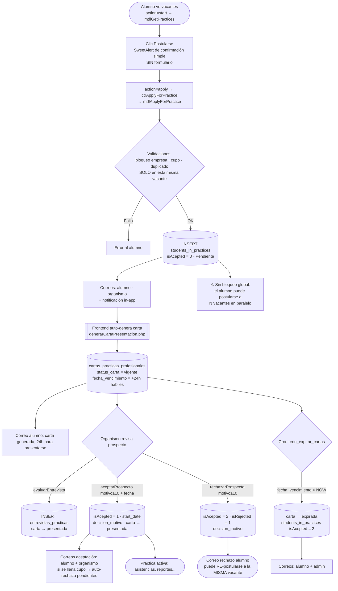
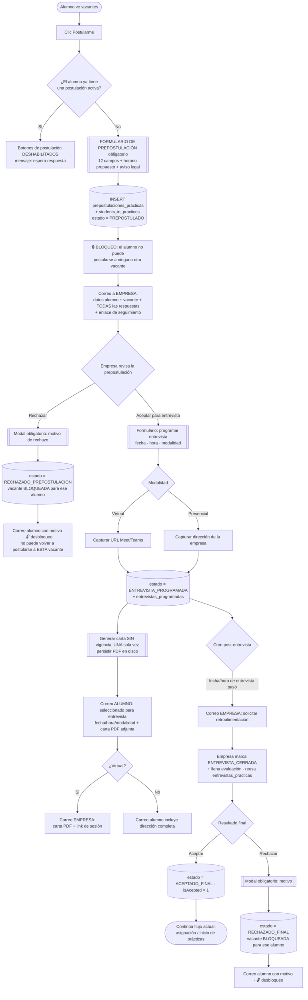
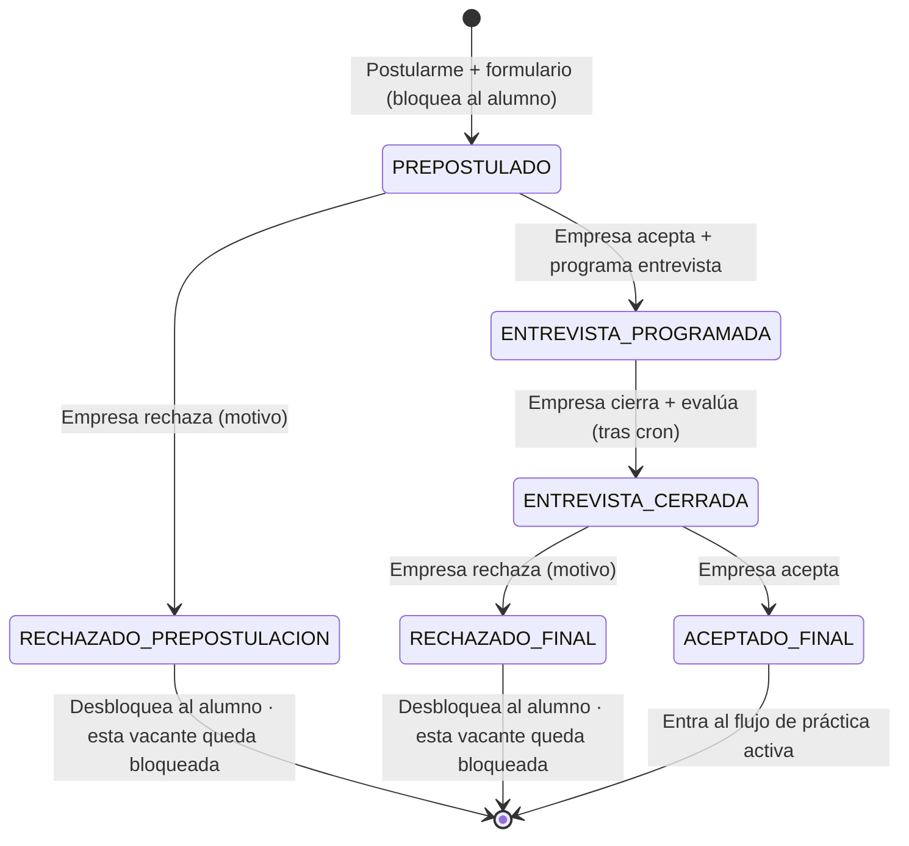

# Análisis técnico — Nuevo flujo de postulación (Prácticas Profesionales)

> **Estado:** Fase 1 (Análisis) + Fase 2 (Plan técnico). **NO se ha modificado ningún archivo del sistema.**
> Este documento se entrega para revisión y aprobación. La Fase 3 (Implementación) **no comenzará hasta recibir confirmación explícita.**
> Generado: julio 2026 · Workspace: `servicioypracticas.unimontrer.edu.mx`

---

## 0. Resumen ejecutivo (lo que debes saber antes de decidir)

El cambio reemplaza la postulación **de un clic** por un flujo de **preselección + entrevista programada + resultado final**. Tras auditar el código real (no solo la documentación), estos son los hallazgos que condicionan todo el diseño:

1. **La documentación previa está parcialmente desactualizada.** El flujo real de postulación **no** pasa por `applyForPractice` / `practices_available` (nombres legados). El camino vivo es:
   `botón .apply-practice` → `practicesApp.js::handleApplyClick()` → `action:"apply"` → `controller/practices/students.php` → `controller/practices/students_flow.php` (`case 'apply'`) → `PracticasController::ctrApplyForPractice()` → `PracticasModel::mdlApplyForPractice()`.

2. **Hoy NO existe bloqueo de postulación múltiple.** Un alumno puede postularse a **muchas vacantes a la vez** (todas quedan `isAcepted = 0`). El único "candado" aparece cuando ya fue **aceptado** (`isAcepted = 1`) en alguna. Tampoco hay `UNIQUE(idPractica, idStudent)` en la base. → **El requisito "una sola postulación activa" es funcionalidad nueva, no un ajuste.**

3. **Hoy la carta de presentación se genera en la postulación, no tras la entrevista.** Al confirmar el clic, el frontend **auto-genera** la carta (`practicesApp.js::generateLetter()` → `controller/practices/generarCartaPresentacion.php`), le calcula un **vencimiento de 24 h hábiles** (`BusinessHoursHelper::calcularVencimientoCarta`) y la hace *stream* al navegador **sin guardarla en disco**. → El nuevo flujo debe **mover** la generación al momento de aceptar la entrevista, **quitar la vigencia** y **persistir el PDF** para poder adjuntarlo a correos.

4. **El estado de la postulación se codifica en un solo `tinyint` (`isAcepted`: 0/1/2)**, insuficiente para la nueva máquina de 6 estados. Habrá que introducir un estado granular.

5. **La evaluación de la entrevista ya existe** (`entrevistas_practicas`, creada en `database/update_fase5.php`) pero **solo guarda la evaluación posterior** (llegó a tiempo, formal, calificación, comentarios). **No** guarda la **programación** de la entrevista (fecha/hora/modalidad/URL/dirección): eso es nuevo.

6. **Migraciones = scripts PHP idempotentes.** El proyecto no mantiene `DB-nodata.sql` al día; los cambios de esquema viven en `database/update_faseN.php` (`SHOW COLUMNS ... LIKE`, `CREATE TABLE IF NOT EXISTS`, e inserción condicional de plantillas en `email_templates`). Las nuevas migraciones deben seguir ese patrón.

> **Nota de UX (memoria del proyecto):** los usuarios son neófitos en tecnología; los nuevos formularios (prepostulación, programación de entrevista) deben ser **visuales y guiados** (wizard por pasos, validación amable), no formularios crudos.

---

## 1. Diagrama del flujo ACTUAL

**Lectura del estado actual (`students_in_practices.isAcepted`):** `0` = Pendiente · `1` = Aceptado · `2` = Rechazado/Expirado. El motivo se guarda en `decision_motivo`; la fecha de inicio en `start_date`. La "presentación" no vive aquí sino en `cartas_practicas_profesionales.status_carta`.

---

## 2. Diagrama del flujo NUEVO

### Máquina de estados nueva

**Mapeo a lo existente:** `ACEPTADO_FINAL` ⇒ `isAcepted = 1` (para no romper el resto del sistema, que cuenta cupo y oculta el listado con `isAcepted = 1`). El resto de estados son nuevos y viven en una columna `estado` a introducir.

---

## 3. Diferencias entre ambos flujos

| Aspecto | Flujo ACTUAL | Flujo NUEVO |
|---|---|---|
| Al hacer clic en Postularme | SweetAlert de confirmación, **sin datos** | **Formulario de prepostulación obligatorio** (12 campos + horario + aviso legal) |
| Postulaciones simultáneas | **Ilimitadas** (varias vacantes en paralelo) | **Una sola activa**; se bloquean todos los botones hasta que la empresa responda |
| Momento de la carta | Se genera **en la postulación** (auto) | Se genera **al aceptar la entrevista**, una sola vez |
| Vigencia de la carta | **24 h hábiles** (`fecha_vencimiento`, cron de expiración) | **Sin vigencia** |
| Persistencia de la carta | *Stream* al navegador, **no se guarda** | Se **guarda en disco** y se **adjunta** a correos |
| Entrevista | Presencial implícita (el alumno se presenta con la carta en 24 h) | **Programada** por la empresa: fecha, hora, modalidad, URL/dirección |
| Evaluación de entrevista | `entrevistas_practicas` (post-entrevista) | Se **reutiliza** `entrevistas_practicas` en el paso de cierre |
| Cierre de entrevista | No existe como paso | **Cron** solicita retroalimentación → empresa marca **ENTREVISTA_CERRADA** |
| Rechazo | Alumno puede **re-postularse a la misma vacante** | Vacante rechazada **bloqueada** para ese alumno |
| Estado | `isAcepted` (0/1/2) | Columna `estado` con 6 valores + `isAcepted` para el final |
| Notificación a la empresa | "Nueva postulación" (genérica, sin datos del perfil) | Correo con **todas las respuestas** del formulario + enlace de seguimiento |
| Cron | `cron_expirar_cartas.php` (expira cartas) | **Se retira** ese cron; **se agrega** cron de retroalimentación post-entrevista |

---

## 4. Tablas afectadas

> Esquema real tomado de `database/DB.sql` + migraciones `database/update_fase*.php` (el `DB-nodata.sql` está desactualizado).

### 4.1 Existentes que se modifican

| Tabla | Columnas actuales relevantes | Cambio propuesto |
|---|---|---|
| `students_in_practices` | `idSiP, idPractica, idStudent, isAcepted(0/1/2), start_date, dateCreated, decision_motivo, decision_fecha, isRejected` | **+ `estado`** ENUM/VARCHAR con los 6 estados nuevos. `isAcepted` se mantiene sincronizado (=1 solo en `ACEPTADO_FINAL`). Agregar índice/`UNIQUE(idPractica, idStudent)` para integridad. |
| `entrevistas_practicas` | `id, idStudent, idPractica, llego_a_tiempo, llego_formal, calificacion_respuestas, comentarios, fecha_entrevista, evaluado_por` | Se **reutiliza** para la evaluación del cierre (paso 5). Corregir el índice a **`UNIQUE(idStudent, idPractica)`** para que funcione el `ON DUPLICATE KEY UPDATE` de `mdlEvaluarEntrevista` (hoy la KEY es no única → duplica filas). |
| `cartas_practicas_profesionales` | `id, code, student_id, fecha_generacion, fecha_vencimiento, status_carta('vigente','presentada','expirada'), fecha_presentacion, confirmada_por` | Dejar `fecha_vencimiento` **NULL** (sin vigencia). Agregar `pdf_path` (ruta del PDF persistido) e `idPractica` para ligar la carta a la vacante/entrevista concreta. El estado `'expirada'` queda en desuso. |

### 4.2 Nuevas tablas propuestas

| Tabla | Propósito | Columnas núcleo |
|---|---|---|
| `prepostulaciones_practicas` | Guardar las **respuestas del formulario** para consulta posterior (requisito de negocio) | `id, idStudent, idPractica, licenciatura, disponibilidad_horario, modalidad, nivel_office, herramientas(JSON/text), nivel_ingles, equipo_remoto, disponibilidad_inicio, area_interes, acepta_capacitacion, objetivo_practicas, modalidad_entrevista_pref, horario_propuesto, created_at` |
| `entrevistas_programadas` | Datos de **agenda** de la entrevista (distintos de la evaluación) | `id, idStudent, idPractica, fecha, hora, modalidad('Presencial','Virtual'), url_sesion, direccion, retro_solicitada(tinyint), created_by, created_at` |
| `alumno_vacante_bloqueo` | Impedir re-postulación a una vacante **rechazada** para ese alumno | `id, idStudent, idPractica, motivo, origen('prepostulacion','final'), created_at` · `UNIQUE(idStudent, idPractica)` |

> **Decisión de diseño abierta (ver §9):** las respuestas del formulario podrían guardarse como columnas explícitas (recomendado, consultables) o como un único campo JSON. Y la programación de entrevista podría **extender** `entrevistas_practicas` en lugar de tabla nueva. Se recomienda tabla nueva para no entrelazar los dos ciclos de vida (agenda vs. evaluación).

---

## 5. Controladores / modelos / vistas afectados

### 5.1 Backend (PHP)

| Capa | Archivo | Función / punto | Cambio |
|---|---|---|---|
| Router alumno | `controller/practices/students_flow.php` | `case 'apply'` (~L92) | Recibir y validar los campos del formulario de prepostulación; verificar que el alumno **no tenga postulación activa**; verificar que la vacante **no esté bloqueada** para él. |
| Controlador | `controller/forms.controller.php` | `ctrApplyForPractice` (L946) | Persistir la prepostulación, crear el registro en estado `PREPOSTULADO`, activar el bloqueo global y disparar el correo a la empresa con las respuestas. |
| Controlador | `controller/forms.controller.php` | `ctrAceptarProspecto` (L1036), `ctrRechazarProspecto` (L1095) | Renombrar semánticamente: hoy son la decisión final. Se dividen en **prepostulación** (aceptar-para-entrevista / rechazar-prepostulación) y **final** (aceptar / rechazar). Rechazo debe registrar bloqueo de vacante y desbloquear al alumno. |
| Controlador | `controller/forms.controller.php` | `ctrEvaluarEntrevista` (L1113), `ctrConfirmarPresentacion` (L1083) | `evaluarEntrevista` se reencuadra como **cierre de entrevista**; `confirmarPresentacion` (basado en vigencia de carta) queda **obsoleto**. |
| Controlador | `controller/forms.controller.php` (nuevo) | `ctrProgramarEntrevista`, `ctrCerrarEntrevista`, `ctrDecisionFinal` | Nuevas acciones para agenda, cierre y resultado final. |
| Modelo | `model/PracticasModel.php` | `mdlApplyForPractice` (L1167) | Cambiar de INSERT simple a: verificar postulación activa (nueva query global), verificar vacante bloqueada, INSERT prepostulación + estado `PREPOSTULADO`. **Quitar** la re-postulación automática a vacante rechazada (L1203-1206). |
| Modelo | `model/PracticasModel.php` | `mdlGetPractices` (L1104) | Agregar marca "el alumno tiene postulación activa" (para deshabilitar botones) y excluir/marcar vacantes bloqueadas. |
| Modelo | `model/PracticasModel.php` | `mdlAceptarProspecto` (L1297), `mdlRechazarProspecto` (L1336) | Adaptar a los nuevos estados; el rechazo inserta en `alumno_vacante_bloqueo` y libera el bloqueo global del alumno. |
| Modelo | `model/PracticasModel.php` (nuevo) | `mdlGuardarPrepostulacion`, `mdlTienePostulacionActiva`, `mdlProgramarEntrevista`, `mdlCerrarEntrevista`, `mdlGetEntrevistasPendientesRetro`, `mdlBloquearVacanteAlumno` | Nueva persistencia. |
| Carta | `controller/practices/generarCartaPresentacion.php` | Todo el archivo | **Quitar** `BusinessHoursHelper::calcularVencimientoCarta` + `mdlUpdateVencimientoCarta` + correo de 24h. **Persistir** el PDF a disco (p.ej. `uploads/cartas_presentacion/{idStudent}_{folio}.pdf`) además de/ en vez de *stream*. Invocar desde el backend al **aceptar la entrevista**, no desde el frontend al postularse. |
| Organismo | `controller/organismo/forms.php` | cases `aceptarProspecto` (L155), `rechazarProspecto` (L176), `evaluarEntrevista` (L196), `confirmarPresentacion` (L220) | Añadir cases nuevos: `aceptarPrepostulacion`/`programarEntrevista`, `rechazarPrepostulacion`, `cerrarEntrevista`, `decisionFinal`. Mantener verificación de propiedad (403). |
| Correos | `controller/emails.php` | ver §7 | Nuevas funciones `send*` + plantillas. |

### 5.2 Frontend (vistas / JS)

| Archivo | Punto | Cambio |
|---|---|---|
| `view/assets/js/student/practicesApp.js` | `handleApplyClick()` (L570) | Reemplazar el `Swal.fire` de confirmación por un **wizard/modal de prepostulación** (12 campos + horario + aviso legal). Enviar los datos con `action:"apply"`. |
| `view/assets/js/student/practicesApp.js` | `generateLetter()` (L644) | **Eliminar** la auto-generación de carta al postularse. |
| `view/assets/js/student/practicesApp.js` | `buttonHTML()` (L440), `renderSolicitudes()` (L230) | Si el alumno tiene postulación activa → **deshabilitar todos** los botones "Postularse" con mensaje. Ocultar/boquear vacantes ya rechazadas para él. |
| `view/pages/practicas/dashboardStudent.php` | contenedores (L295-305) | Añadir el markup base del modal/wizard de prepostulación (o inyectarlo por JS). |
| `view/assets/js/organismo/solicitudes.js` | `renderDetalleSolicitud()` (L376), handlers `.btn-evaluar-entrevista` (L563), `.btn-aceptar-prospecto` (L644), `.btn-rechazar-prospecto` (L834) | Rediseñar botones por prospecto según los 6 estados: "Ver prepostulación", "Aceptar para entrevista" (abre form de agenda), "Rechazar prepostulación", "Cerrar entrevista + evaluar", "Aceptar", "Rechazar". Reusar el patrón SweetAlert-con-formulario ya presente. |
| `view/pages/practicas/modalSolPracticantes.php` | `#viewUsersModal` / `#prospectsList` (L987-996), `#solicitudesModal` (L576) | Aprovechar el modal de candidatos (hoy infrautilizado) para mostrar la **ficha de prepostulación** completa y los botones de decisión. Añadir modal de **programación de entrevista**. |

---

## 6. Riesgos técnicos

| # | Riesgo | Impacto | Mitigación |
|---|---|---|---|
| R1 | **Doble fuente de verdad del estado** (`isAcepted` está acoplado en frontend `buttonHTML`, conteo de cupo, `ctrIsStudentRegisteredInPractices`, cron). Introducir `estado` puede desincronizar. | Alto | Mantener `isAcepted` derivado de `estado` en TODAS las escrituras; un único método de modelo que cambie estado y sincronice `isAcepted`. Pruebas de regresión de cupo/listado. |
| R2 | **Persistir el PDF de la carta** (hoy solo *stream*). Rutas, permisos de `uploads/`, y `dompdf` síncrono con imágenes → posibles timeouts (OPT-005). | Medio | Guardar en `uploads/cartas_presentacion/`; verificar escritura; considerar generación diferida si crece el tamaño. Adjuntar por **ruta de archivo** (así funcionan los adjuntos de `email_queue`). |
| R3 | **Sin CSRF ni validación de rol** en los endpoints (`ajax.forms.php`, `organismo/forms.php`) — SEC-002/004. Los nuevos endpoints heredan el problema. | Alto | Añadir `Security::validateCsrf()` + verificación de rol en los cases nuevos; mantener la verificación de propiedad (403) ya presente en el organismo. |
| R4 | **`ON DUPLICATE KEY UPDATE` en `entrevistas_practicas` sin índice único** → hoy inserta duplicados. Al reutilizarla se agravará. | Medio | Migración que añade `UNIQUE(idStudent, idPractica)` **previa deduplicación** de filas existentes. |
| R5 | **Cambio de comportamiento en rechazo**: hoy el alumno puede re-postularse a la misma vacante; el nuevo flujo lo prohíbe. Puede confundir a usuarios acostumbrados. | Bajo | Mensaje claro en UI + registro en `alumno_vacante_bloqueo`. Documentar. |
| R6 | **Bloqueo global mal liberado** deja al alumno "atascado" sin poder postularse. | Alto | El desbloqueo debe dispararse en TODA rama terminal de rechazo (prepostulación y final) y en expiración/cancelación. Job de reconciliación opcional. |
| R7 | **Migración de datos en curso**: alumnos con postulaciones vivas bajo el modelo viejo (cartas vigentes, `isAcepted=0/1/2`). | Medio | Script de *backfill* que mapee registros existentes a `estado` y decida qué hacer con cartas vigentes. Ventana de despliegue coordinada. |
| R8 | **Reloj/hábiles**: el cron post-entrevista depende de fecha/hora de la entrevista y zona horaria (`America/Mexico_City`). | Bajo | Reutilizar `date_default_timezone_set` como el cron actual; comparar en SQL con `NOW()` del servidor. |
| R9 | **Preview del editor de correos** duplica el wrapper del mailer (memoria del proyecto). Nuevas plantillas deben mantenerse en sincronía. | Bajo | Al tocar layout de correos, actualizar `buildEmailDoc()` del editor. |
| R10 | **Envío de datos personales a la empresa** (todas las respuestas del formulario) por correo. | Medio (privacidad) | Incluir solo lo necesario; enlace de seguimiento autenticado en vez de volcar todo; revisar aviso legal. |

---

## 7. Cambios en correos

> Mecanismo: `MailService::sendMail(...)` encola en `email_queue`; los **adjuntos son rutas de archivo en disco** (`is_file()`), guardadas como JSON y adjuntadas por el cron `process_email_queue.php`. Para adjuntar la carta **hay que persistir el PDF primero** (ver R2).

### 7.1 Nuevos correos

| Evento (paso) | Destinatario | Contenido | Adjunto |
|---|---|---|---|
| Prepostulación enviada (paso 3) | **Empresa** | Datos del alumno + vacante + **todas** las respuestas del formulario + enlace de seguimiento | — |
| Entrevista programada (paso 4) | **Alumno** | Seleccionado para entrevista, fecha/hora/modalidad; si presencial, **dirección completa** | **Carta PDF** |
| Entrevista virtual (paso 4.2) | **Empresa** | Link de la sesión (Meet/Teams) | **Carta PDF** |
| Solicitud de retroalimentación (paso 5) | **Empresa** | Pide ingresar a cerrar la entrevista y evaluar | — |

### 7.2 Correos reutilizables / a adaptar

| Función existente | Uso nuevo |
|---|---|
| `sendPracticasProspectRejectedWithReason` (`pp_prospecto_rechazado_motivo`) | Rechazo de **prepostulación** (3.1.1) y rechazo **final** (6.2) |
| `sendPracticasProspectAcceptedWithReason` (`pp_prospecto_aceptado_motivo`) | Aceptación **final** al alumno (6.1) |
| `sendPracticesApplicationReceived` (`practices_application_received`) | Confirmación al alumno de que su **prepostulación** fue recibida (opcional) |

### 7.3 Correos a retirar

| Función / plantilla | Motivo |
|---|---|
| `sendPpCartaPresentacionGenerada` (`pp_carta_presentacion_generada`) | Ya no hay carta con vigencia de 24h al postularse |
| `sendPpCartaPresentacionExpirada` / `...ExpiradaAdmin` | No hay expiración de carta |
| `sendPpCartaPresentacionConfirmada` | La "confirmación de presentación" por vigencia desaparece |

---

## 8. Cambios en cron

| Cron | Estado | Acción |
|---|---|---|
| `controller/cron/cron_expirar_cartas.php` | **Retirar** | Deja de tener sentido (sin vigencia). Se puede dejar el archivo neutralizado o quitar de la tarea programada. Sus modelos `mdlGetCartasExpiradas` / `mdlExpirarCarta` quedan sin uso. |
| `controller/cron/cron_retroalimentacion_entrevista.php` | **Nuevo** | Busca `entrevistas_programadas` cuya fecha/hora ya pasó y `retro_solicitada = 0` y `estado = ENTREVISTA_PROGRAMADA`; envía correo a la empresa; marca `retro_solicitada = 1` para no reenviar. Sigue el patrón del cron actual (timezone CDMX, salida por `echo`). |

---

## 9. Decisiones que requieren tu confirmación

1. **Almacenamiento de respuestas** de prepostulación: columnas explícitas (recomendado, consultables/reportables) vs. un único campo JSON.
2. **Programación de entrevista**: tabla nueva `entrevistas_programadas` (recomendado) vs. extender `entrevistas_practicas`.
3. **Estado**: columna `estado` ENUM en `students_in_practices` (recomendado) vs. reinterpretar `isAcepted`.
4. **"Formulario de evaluación que ya existe" (paso 5)**: ¿se refiere a la evaluación de entrevista (`entrevistas_practicas`: llegó a tiempo, formal, calificación, comentarios) — que es lo que encaja — o a las rúbricas de 180h/360h? Asumo la **evaluación de entrevista**.
5. **Bloqueo de vacante rechazada**: tabla `alumno_vacante_bloqueo` (recomendado) vs. reusar `isAcepted = 2` cambiando la lógica de re-postulación.
6. **Migración de datos en vuelo**: ¿hay postulaciones/cartas activas hoy que haya que migrar, o se despliega en ventana limpia?
7. **Aviso legal / privacidad**: ¿se envían TODAS las respuestas del formulario por correo a la empresa, o solo un resumen + enlace autenticado?

---

# Fase 2 — Plan técnico de implementación por etapas

> Cada etapa es incremental y verificable. No se toca código hasta tu aprobación (Fase 3).

## Etapa 0 — Preparación
- Confirmar las 7 decisiones de §9.
- Rama de trabajo dedicada; respaldo de BD.
- Congelar el patrón: migraciones como `database/update_fase6_*.php` idempotentes.

## Etapa 1 — Base de datos (migraciones idempotentes)
1. `update_fase6_prepostulacion.php`: crea `prepostulaciones_practicas`.
2. `update_fase6_estado_postulacion.php`: `ALTER students_in_practices ADD COLUMN estado ...`; *backfill* desde `isAcepted`; `UNIQUE(idPractica, idStudent)`.
3. `update_fase6_entrevistas_programadas.php`: crea `entrevistas_programadas`; deduplica y añade `UNIQUE(idStudent, idPractica)` en `entrevistas_practicas`.
4. `update_fase6_bloqueo_vacante.php`: crea `alumno_vacante_bloqueo`.
5. `update_fase6_carta.php`: `cartas_practicas_profesionales` → `pdf_path`, `idPractica`; `fecha_vencimiento` nullable.
6. Inserción condicional de nuevas plantillas en `email_templates`.

## Etapa 2 — Backend (modelo + controlador)
1. Modelo: `mdlGuardarPrepostulacion`, `mdlTienePostulacionActiva`, `mdlSetEstadoPostulacion` (sincroniza `isAcepted`), `mdlProgramarEntrevista`, `mdlCerrarEntrevista`, `mdlBloquearVacanteAlumno`, `mdlGetEntrevistasPendientesRetro`.
2. Adaptar `mdlApplyForPractice` (prepostulación + bloqueo global, quitar re-postulación a vacante rechazada) y `mdlGetPractices` (marca de postulación activa / vacantes bloqueadas).
3. Controladores nuevos: `ctrProgramarEntrevista`, `ctrCerrarEntrevista`, `ctrDecisionFinal`; adaptar `ctrApplyForPractice`, `ctrAceptar/RechazarProspecto`.
4. Endpoints: cases nuevos en `students_flow.php` y `organismo/forms.php` **con CSRF + verificación de rol/propiedad** (R3).

## Etapa 3 — Frontend
1. Alumno: wizard/modal de **prepostulación** (visual y guiado, memoria de usuarios neófitos); deshabilitar botones si hay postulación activa; quitar auto-generación de carta.
2. Organismo: botones por estado en `renderDetalleSolicitud`; modal de **programación de entrevista**; ficha de **prepostulación** en `#viewUsersModal`/`#prospectsList`; modales de motivo obligatorio.

## Etapa 4 — Carta de presentación
1. Refactor de `generarCartaPresentacion.php`: sin vigencia, persistir PDF, generar una sola vez, invocable desde backend al aceptar entrevista.
2. Ligar la carta a `idPractica` para reusar su ruta en los correos.

## Etapa 5 — Correos
1. Nuevas funciones `send*` + plantillas (empresa-prepostulación, alumno-entrevista, empresa-virtual, empresa-retroalimentación).
2. Adjuntar la carta por **ruta de archivo**.
3. Reusar plantillas de aceptación/rechazo; retirar las de vigencia/expiración.
4. Sincronizar el preview del editor si cambia el layout (R9).

## Etapa 6 — Cron
1. Nuevo `cron_retroalimentacion_entrevista.php` (idempotente, marca `retro_solicitada`).
2. Retirar `cron_expirar_cartas.php` de la tarea programada.

## Etapa 7 — Pruebas
- **Unitarias/manuales de modelo:** transiciones de estado y sincronía con `isAcepted`; bloqueo global (una sola postulación activa); bloqueo de vacante rechazada; conteo de cupo intacto.
- **Integración:** postular → correo empresa con respuestas → aceptar/rechazar prepostulación → programar entrevista → correos con carta → cron de retroalimentación → cerrar + evaluar → aceptar/rechazar final → desbloqueo.
- **Seguridad:** CSRF, rol, propiedad (403) en cada endpoint nuevo; IDOR.
- **Regresión:** flujos que dependen de `isAcepted` (listado, cupo, asistencias) y de la carta.
- **Datos:** verificar *backfill* de registros existentes.

---

## 10. Referencias cruzadas
- Flujo actual (a corregir con estos hallazgos): `docs/flujo_postulacion_alumnos.md`
- Vacantes y habilidades: `docs/flujo_vacantes_practicantes.md`
- Evaluaciones y reportes (reutilización): `docs/flujo_reportes_evaluaciones_practicas.md`
- Correos, cola y cron: `docs/flujo_correos.md`, `docs/mails/practicas_profesionales.md`
- Arquitectura y auditoría de seguridad (SEC-*, OPT-*): `docs/arquitectura_sistema.md`

---

> **Siguiente paso:** revisa este análisis y el plan. Cuando confirmes las decisiones de §9 y apruebes, comenzaré la Fase 3 (implementación) por etapas. **No modificaré ningún archivo hasta entonces.**
