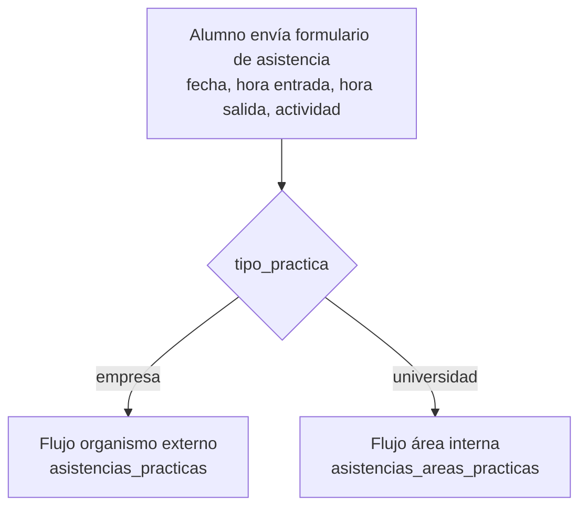
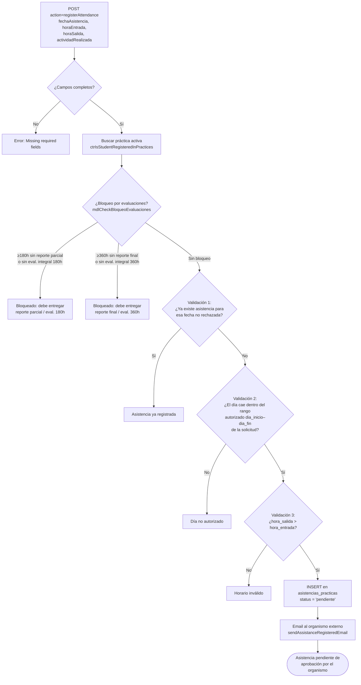
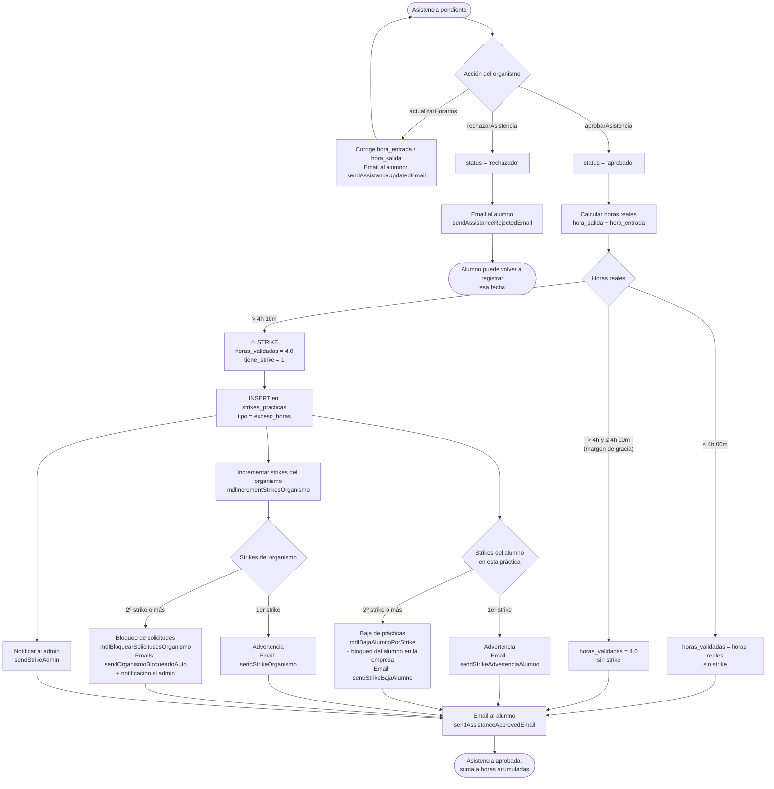
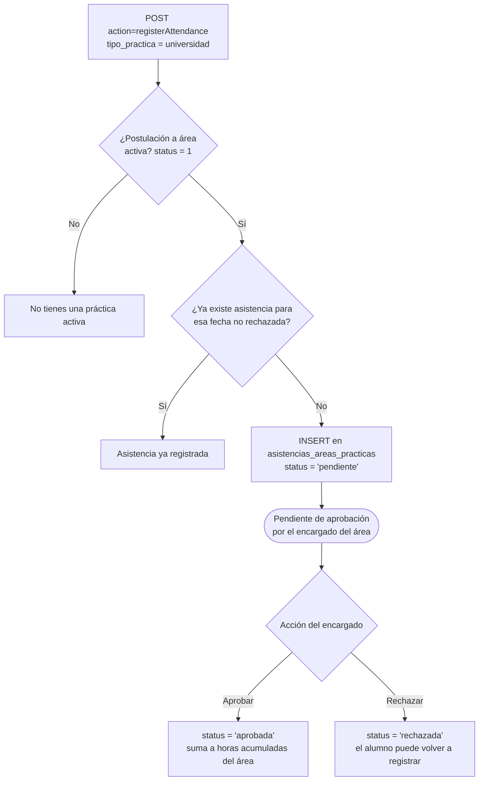
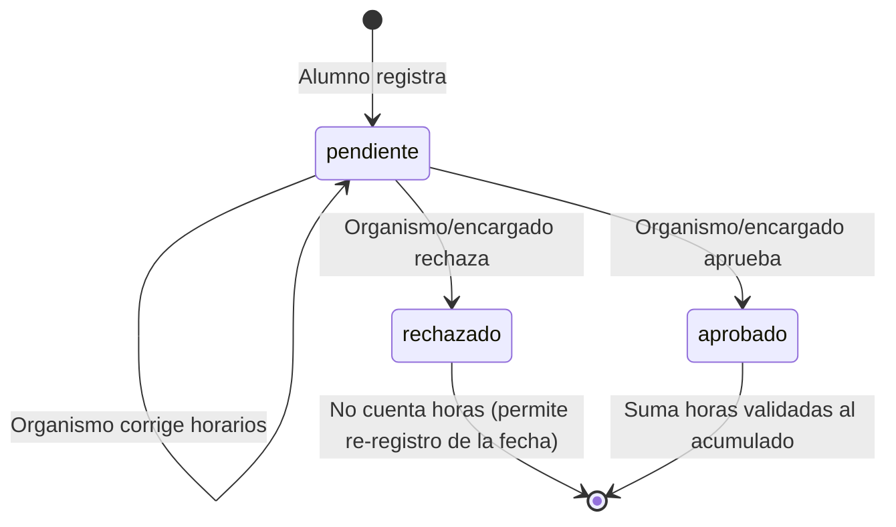

# Flujo de asistencias de los alumnos (Prácticas)

Este documento describe el ciclo de vida completo de una asistencia registrada por un alumno de prácticas, desde el registro hasta su aprobación/rechazo, incluyendo la lógica de strikes (Fase 3).

**Archivos involucrados:**

| Capa | Archivo | Responsabilidad |
|---|---|---|
| Router alumno | `controller/practices/students_flow.php` (case `registerAttendance`) | Recibe el POST del alumno y decide el flujo según `tipo_practica` |
| Router organismo | `controller/organismo/forms.php` (cases `aprobarAsistencia`, `rechazarAsistencia`, `actualizarHorarios`) | Acciones del organismo externo |
| Controlador | `controller/forms.controller.php` | `ctrRegisterAttendance`, `ctrAprobarAsistencia`, `ctrRechazarAsistencia`, `ctrRegisterAttendanceArea`, `ctrAprobarAsistenciaArea` |
| Modelo | `model/PracticasModel.php` | `mdlRegisterAttendance`, `mdlRegisterAttendanceArea`, `mdlCheckBloqueoEvaluaciones`, lógica de strikes |
| Correos | `controller/emails.php` | Notificaciones de registro, aprobación, rechazo y strikes |

**Tablas:** `asistencias_practicas` (empresa), `asistencias_areas_practicas` (universidad), `strikes_practicas`, `students_practicas`, `organismos_externos`.

---

## 1. Vista general

Existen **dos flujos** según el tipo de práctica del alumno (`$_SESSION['user']['tipo_practica']`):

- **`empresa`** → práctica en organismo externo. La asistencia la aprueba el **organismo externo** y aplica lógica de strikes.
- **`universidad`** → práctica en área interna de la universidad. La asistencia la aprueba el **encargado del área** (sin strikes).

---

## 2. Flujo empresa (organismo externo) — Registro

`students_flow.php` → `ctrRegisterAttendance()` → `mdlRegisterAttendance()`

> **Nota Fase 3:** la validación estricta de máximo 4 horas diarias en el registro está **comentada** intencionalmente (`mdlRegisterAttendance`, `model/PracticasModel.php` ~línea 1542). Se permite registrar el exceso para que el organismo lo evalúe y, en su caso, asigne el strike al aprobar.

---

## 3. Flujo empresa — Aprobación / rechazo y strikes

`controller/organismo/forms.php` → `ctrAprobarAsistencia()` / `ctrRechazarAsistencia()`

El organismo ve las asistencias con `status = 'pendiente'` (`mdlGetAssistancesPractices`) y puede aprobar, rechazar o corregir horarios antes de aprobar.

**Reglas de strikes (Fase 3):**

El límite diario es de **4 horas** con una **tolerancia de 10 minutos** (`$limiteHoras = 4`, `$tolerancia = 10/60` en `ctrAprobarAsistencia`).

| Horas reales de la asistencia | Horas validadas | Strike |
|---|---|---|
| ≤ 4h 00m | Horas reales | No |
| > 4h 00m y ≤ 4h 10m | 4.0 h (se recorta) | No (margen de gracia) |
| > 4h 10m | 4.0 h (se recorta) | **Sí** (para alumno y organismo) |

- **Alumno con 2 strikes** → baja de prácticas (`dado_de_baja_por_strike = 1`) y bloqueo en esa empresa.
- **Organismo con 2 strikes** → bloqueo automático de nuevas solicitudes de practicantes.
- El admin puede revertir strikes (`mdlRemoveStrikeStudent`, `mdlRemoveStrikeOrganismo`); al bajar de 2 se levanta la baja/el bloqueo automáticamente.

---

## 4. Flujo universidad (área interna)

`students_flow.php` → `ctrRegisterAttendanceArea()` → `mdlRegisterAttendanceArea()`. Aprueba el encargado del área (`ctrAprobarAsistenciaArea` / `ctrRechazarAsistenciaArea`).

Diferencias respecto al flujo empresa:

- **No hay strikes** ni recorte de horas validadas.
- **No hay validación de día autorizado** ni de horario entrada/salida en el modelo.
- **No se envían correos** al aprobar/rechazar (solo cambia el status).
- El alumno solo ve en su dashboard las asistencias con `status = 'aprobada'` (`mdlGetAsistenciasArea`).

---

## 5. Estados de una asistencia

Las horas acumuladas aprobadas alimentan los hitos de **180 h** (reporte parcial + evaluación integral intermedia) y **360 h** (reporte final + evaluación integral final), que a su vez bloquean el registro de nuevas asistencias si no se cumplen (ver diagrama del punto 2).

---

## 6. Referencias cruzadas

- Cómo llegó el alumno a la práctica (postulación y presentación): `docs/flujo_postulacion_alumnos.md`
- Hitos 180h/360h, reportes y evaluaciones: `docs/flujo_reportes_evaluaciones_practicas.md`
- Bloqueo de solicitudes del organismo por strikes: `docs/flujo_registro_organismos.md` y `docs/flujo_vacantes_practicantes.md`
- Mecánica de envío de correos (cola): `docs/flujo_correos.md`
