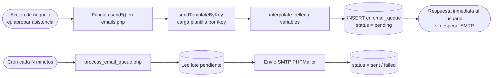
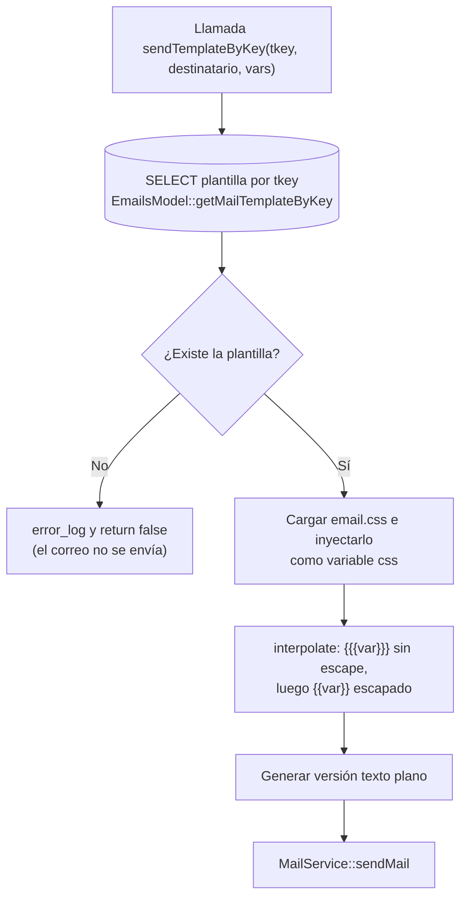
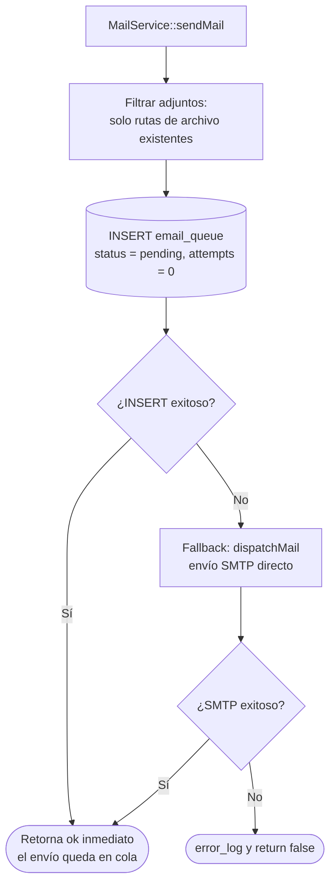
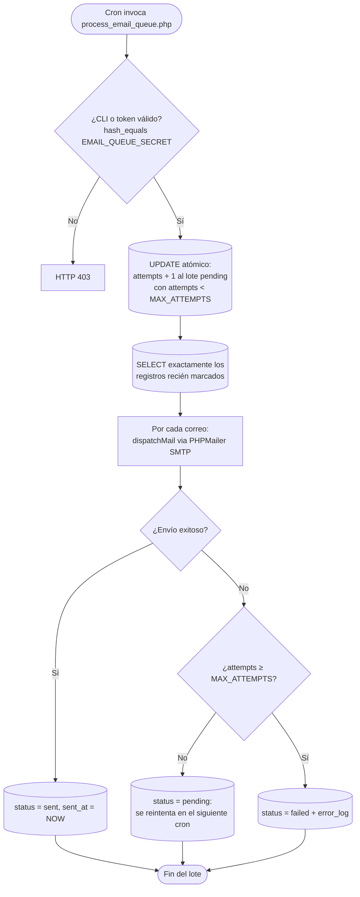
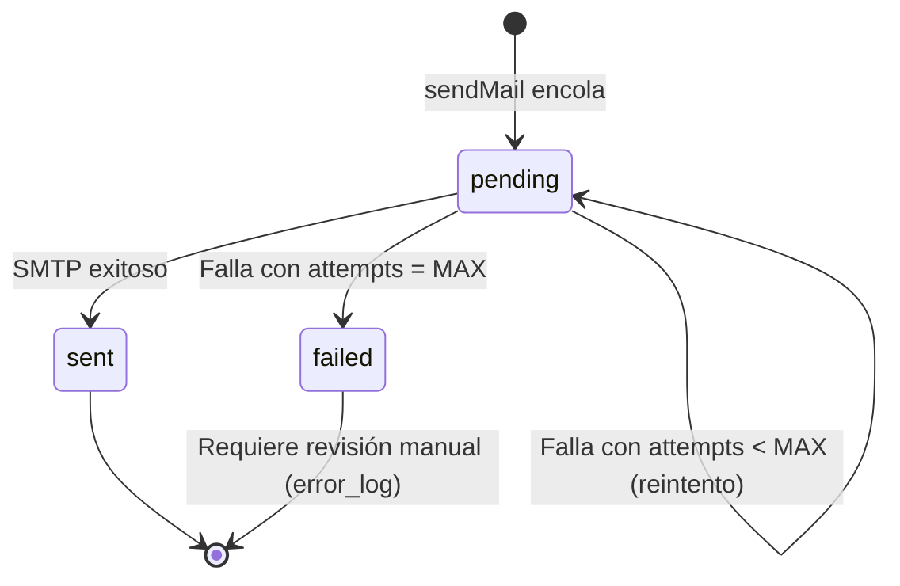

# Flujo de correos — Plantillas, cola y procesamiento

Este documento describe cómo el sistema envía correos: renderizado de plantillas de la tabla `email_templates` (editables desde el panel admin), encolado en `email_queue` (el envío **no bloquea** la petición del usuario) y procesamiento en segundo plano vía cron con reintentos.

**Archivos involucrados:**

| Capa | Archivo | Responsabilidad |
|---|---|---|
| Servicio | `controller/emails.php` (`MailService::sendMail`, `MailService::dispatchMail`, `interpolate`, `sendTemplateByKey`, funciones `send*` por evento) | Render de plantillas y encolado |
| Modelo | `model/EmailsModel.php` (`getMailTemplateByKey`) | Lectura de plantillas |
| Procesador | `controller/process_email_queue.php` | Cron que envía la cola por SMTP con reintentos |
| Editor | Panel admin de plantillas (editor con vista previa) | Edición del asunto/cuerpo de cada `tkey` |
| Estilos | `view/assets/css/email_templates/email.css` | CSS inyectado como variable `{{{css}}}` |
| Config | `.env` (`SMTP_*`, `FROM_EMAIL`, `FROM_NAME`, `EMAIL_QUEUE_SECRET`) | Credenciales SMTP y token del cron |

**Tablas:** `email_queue` (to_email, subject, body, plain_text, from_name, attachments, status, attempts), `email_templates` (plantillas por `tkey`).

> **Catálogo completo de correos** (destinatario, momento de envío y texto): `docs/mails/practicas_profesionales.md` (41 correos) y `docs/mails/servicio_social.md`.

---

## 1. Vista general

---

## 2. Renderizado de plantillas

Las plantillas viven en `email_templates` y se editan desde el panel admin (editor con vista previa). Los placeholders admiten dos sintaxis:

- `{{variable}}` → se reemplaza **escapando HTML** (`htmlspecialchars`).
- `{{{variable}}}` → se reemplaza **sin escape** (para HTML como el CSS o bloques enriquecidos).

> **Nota de mantenimiento:** el editor de plantillas construye su vista previa con `buildEmailDoc()`, que replica el wrapper HTML del mailer. Si cambia el layout en `emails.php`, hay que actualizar también la vista previa para que no diverjan.

---

## 3. Encolado (sendMail)

`MailService::sendMail` **no envía**: inserta en `email_queue` y retorna `'ok'` de inmediato. Solo si el INSERT falla intenta el envío directo como respaldo.

---

## 4. Procesamiento de la cola (cron)

`process_email_queue.php` se ejecuta por cron (CLI o HTTP con token `EMAIL_QUEUE_SECRET`, comparado con `hash_equals`). Marca el lote de forma **atómica** (incrementa `attempts` antes de leer) para evitar dobles envíos si dos procesadores corren a la vez.

---

## 5. Estados de un correo en cola

---

## 6. Observaciones

- **SEC-018:** el token del cron es estático y viaja en la URL en modo HTTP; si los logs del cron son visibles, queda expuesto. Preferir la invocación CLI.
- Los correos `failed` no se re-encolan automáticamente; hay que revisarlos en la tabla.
- Los adjuntos se guardan como rutas JSON; si el archivo se borra antes de que el cron procese el correo, el adjunto simplemente se omite.

---

## 7. Referencias cruzadas

- Catálogo de correos PP: `docs/mails/practicas_profesionales.md`
- Catálogo de correos SS: `docs/mails/servicio_social.md`
- Flujos que disparan correos: `docs/flujo_postulacion_alumnos.md`, `docs/flujo_asistencias_alumnos.md`, `docs/flujo_reportes_evaluaciones_practicas.md`, `docs/flujo_vacantes_practicantes.md`
