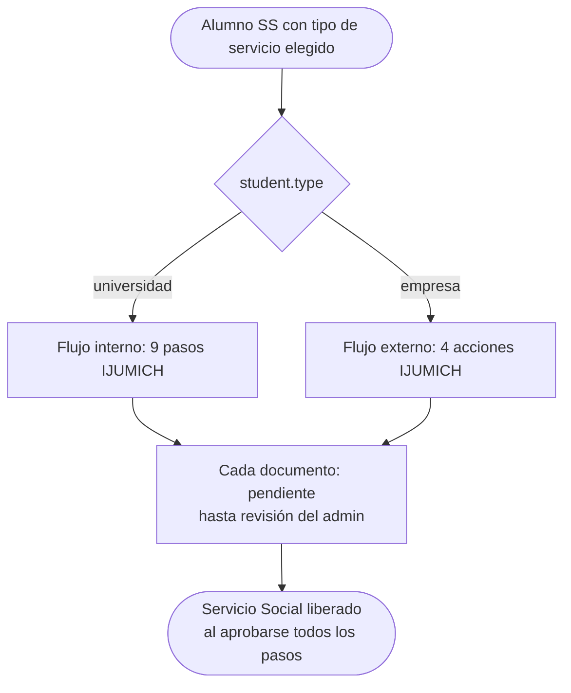
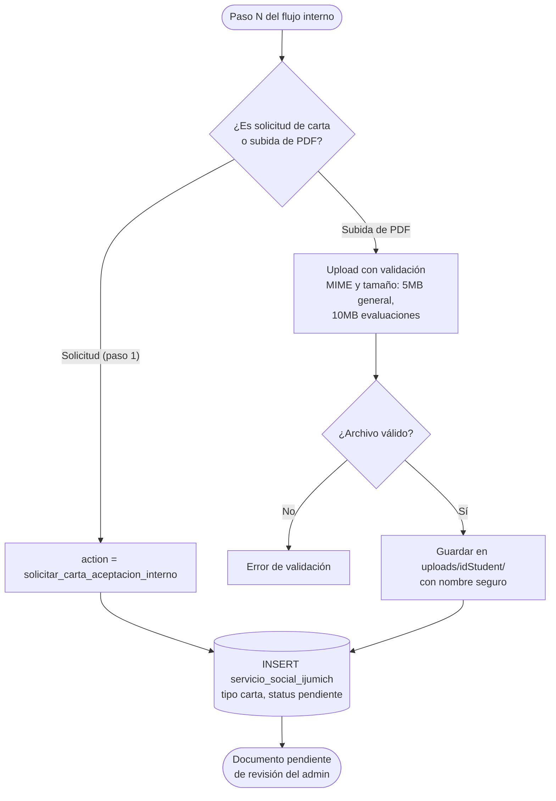
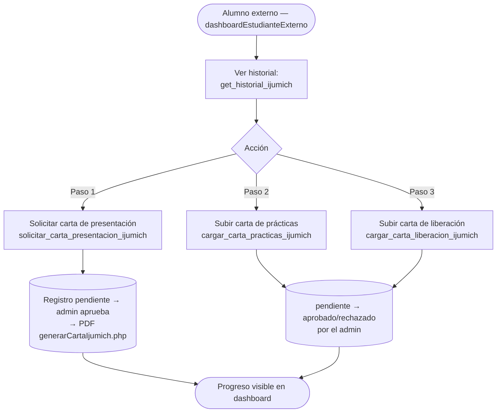
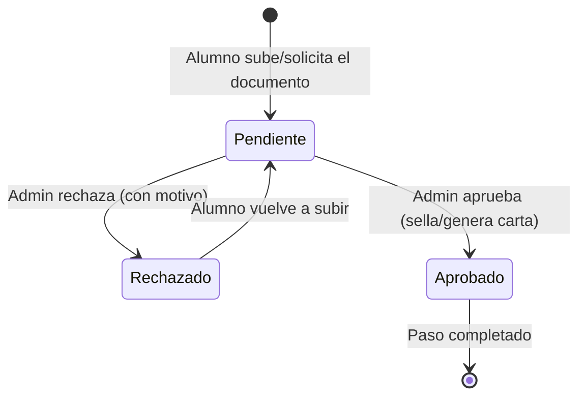

# Flujo documental IJUMICH (Servicio Social)

Este documento describe el flujo de documentos IJUMICH del Servicio Social: los **9 pasos del alumno interno**, el flujo reducido del **alumno externo**, y el ciclo de aprobación/rechazo por el administrador. Cada documento subido o solicitado pasa por el mismo ciclo de estados (`pendiente → aprobado/rechazado`) en la tabla `servicio_social_ijumich`.

**Archivos involucrados:**

| Capa | Archivo | Responsabilidad |
|---|---|---|
| Alumno | `controller/ajax/ajax.forms.php` (actions `cargar_*`, `solicitar_*`, `get_historial_interno`, `get_historial_ijumich`) | Subida de PDFs y solicitudes de cartas |
| Admin | `controller/ajax/ajax.forms.php` (search=`ijumich_requests`: `getPendingRequests`, `approveRequest`, `rejectRequest`) | Aprobación/rechazo (verifica `role === 'admin'`) |
| Modelo | `model/ServicioModel.php` (`mdlGetHistorialInternoAlumno`, `mdlCargarReporteParcial`, `generateFolio`, `generateFolioAceptacion`) | Persistencia y folios |
| Cartas PDF | `controller/ajax/generarCartaAceptacionServicio.php`, `generarCartaPresentacion.php`, `generarCartaIjumich.php`, `generarCartaConclusionServicio.php` | Generación con folio |
| Sellado | `controller/ajax/ajax.forms.php` (`stampPdfWithFirmaYSello`, `stampEvaluacionUnidadProductiva`, `stampEvaluacionGlobal`, `stampSolicitudRegistroBotDer`) | Estampa firma y sello en los PDFs aprobados |

**Tablas:** `servicio_social_ijumich`, `cartas_servicio_social`, `cartas_aceptacion_servicio`, `cartas_conclusion_servicio`, `student`, `email_queue`, `notifications`.

---

## 1. Vista general

El alumno interno (`student.type = 'universidad'`) sigue 9 pasos; el externo (`student.type = 'empresa'`) un flujo reducido. En ambos, el admin revisa cada documento.

---

## 2. Los 9 pasos del alumno interno

Cada paso crea un registro en `servicio_social_ijumich` con su `tipo` y `status`. El dashboard (`get_historial_interno`) muestra el avance.

| Paso | Tipo (BD) | Acción del alumno | Endpoint |
|---|---|---|---|
| 1 | `carta_aceptacion_servicio` | Solicitar carta de aceptación | `solicitar_carta_aceptacion_interno` |
| 2 | `carta_practicas_interno` | Subir carta de finalización de prácticas | `cargar_carta_practicas_interno` |
| 3 | `solicitud_registro` | Subir solicitud de registro (PDF) | `cargar_solicitud_registro` |
| 4–6 | `reporte_parcial_1..3` | Subir reportes parciales #1, #2, #3 | `cargar_reporte_parcial` (num=1..3) |
| 7 | `carta_liberacion_interno` | Subir carta de liberación | `cargar_carta_liberacion_interno` |
| 8 | `evaluacion_unidad_productiva` | Subir evaluación unidad productiva | `cargar_evaluacion_unidad_productiva` |
| 9 | `evaluacion_global` | Subir evaluación global | `cargar_evaluacion_global` |

> El `student_id` se toma **siempre de la sesión**, nunca del POST — previene IDOR en los uploads.

---

## 3. Revisión del administrador

Solo el rol `admin` completo puede aprobar (`role === 'admin'` verificado en el endpoint; un `admin_servicio` no pasa esta verificación a nivel de dispatcher).

```mermaid
flowchart TD
    A([Documento con status pendiente]) --> B[Admin: getPendingRequests]
    B --> C{Decisión por documento}

    C -- rejectRequest --> D[(UPDATE status = rechazado<br/>+ motivo)]
    D --> E[Notificación/correo al alumno]
    E --> F([Alumno corrige y<br/>vuelve a subir el paso])

    C -- approveRequest --> G{¿El paso genera carta<br/>o requiere sello?}
    G -- "Carta (paso 1)" --> H[Generar folio<br/>generateFolioAceptacion]
    H --> I[(INSERT cartas_aceptacion_servicio)]
    I --> J[PDF de carta descargable]
    G -- "PDF subido" --> K[Estampar firma y sello<br/>stampPdf&#42; según tipo]
    K --> L[(UPDATE status = aprobado)]
    J --> L
    L --> M([Paso completado:<br/>avanza al siguiente])
```

> **Nota (SEC-012):** `ServicioModel::generateFolio()` y `generateFolioAceptacion()` no usan `GET_LOCK()`; dos solicitudes simultáneas pueden duplicar folio (a diferencia de `PracticasModel::generateFolioGeneric()`).

---

## 4. Flujo del alumno externo

El alumno externo interactúa con IJUMICH sin los 9 pasos internos:

---

## 5. Estados de un documento IJUMICH

---

## 6. Referencias cruzadas

- Registro del alumno SS y eventos con puntos: `docs/flujo_servicio_social_eventos.md`
- Correos de Servicio Social: `docs/mails/servicio_social.md`
- Deuda técnica en uploads duplicados (DEBT-002) y funciones `stampPdf*` (DEBT-003): `docs/arquitectura_sistema.md`
