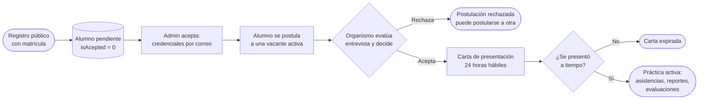
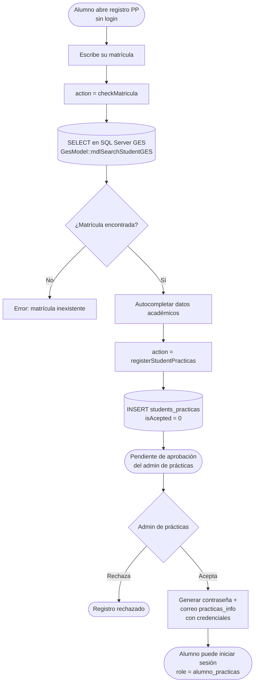
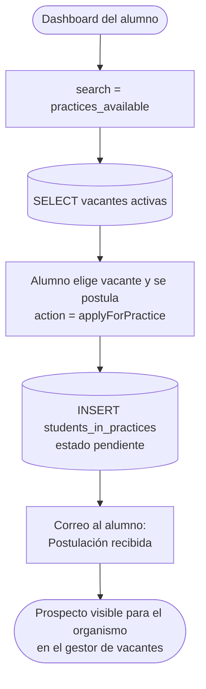
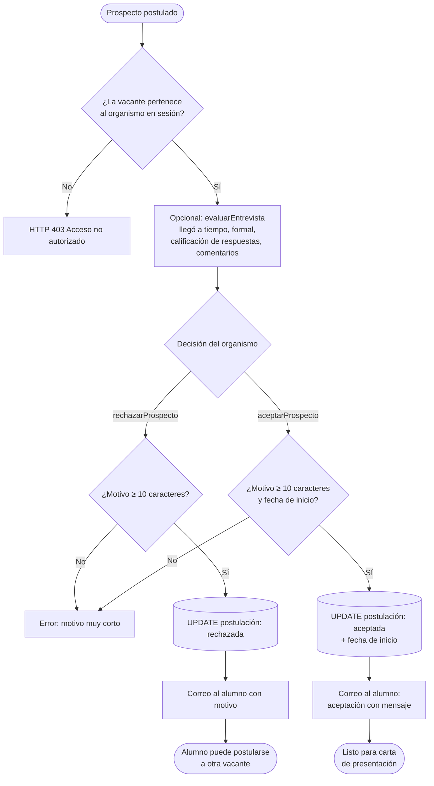
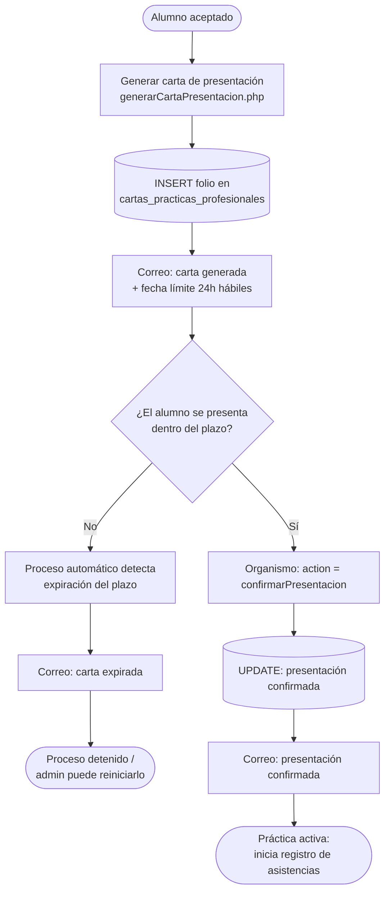
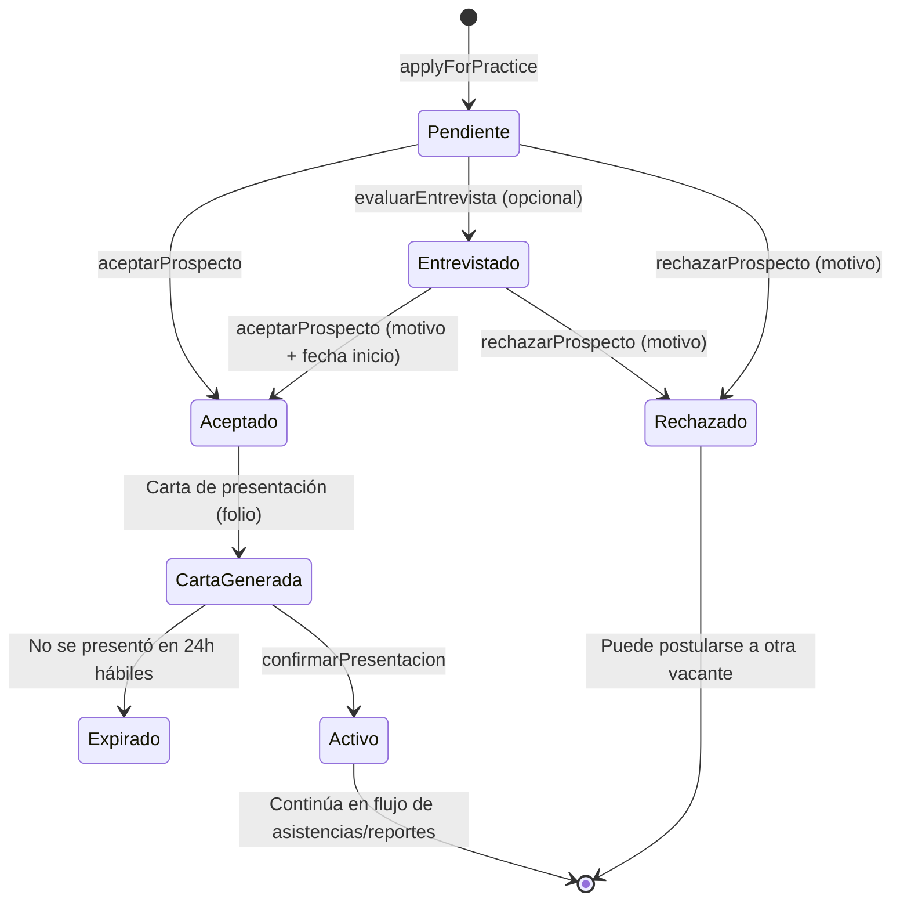

# Flujo de postulación y selección de alumnos (Prácticas)

Este documento describe el camino del alumno de Prácticas Profesionales desde su registro público hasta quedar activo en una práctica: registro con matrícula GES, aprobación del admin, postulación a vacantes, entrevista, aceptación/rechazo por el organismo, carta de presentación (con vigencia de 24 horas hábiles) y confirmación de presentación.

**Archivos involucrados:**

| Capa | Archivo | Responsabilidad |
|---|---|---|
| Registro alumno | `controller/ajax/ajax.forms.php` (`checkMatricula`, `registerStudentPracticas`) | Búsqueda en SQL Server GES y alta en `students_practicas` |
| Admin PP | `controller/ajax/ajax.forms.php` (search=`student`, `acceptStudentPractice`) y `controller/practices/students.php` | Aceptar/rechazar alumnos, reenviar credenciales |
| Postulación | `controller/ajax/ajax.forms.php` (search=`practices_available`, `applyForPractice`) | Vacantes activas y creación de la postulación |
| Organismo | `controller/organismo/forms.php` (cases `evaluarEntrevista`, `aceptarProspecto`, `rechazarProspecto`, `confirmarPresentacion`, `getHistorialAlumnos`) | Selección de candidatos |
| Carta | `controller/practices/generarCartaPresentacion.php` | PDF con folio y fecha límite de presentación |
| Modelo | `model/PracticasModel.php`, `model/GesModel.php` | Persistencia y búsqueda GES |
| Correos | `controller/emails.php` | Credenciales, postulación recibida, aceptación/rechazo, carta generada/expirada, presentación confirmada |

**Tablas:** `students_practicas`, `students_in_practices`, `solicitudes_practicantes`, `cartas_practicas_profesionales`, `organismos_externos`, `email_queue`, `notifications`. Externas: SQL Server **GES** (búsqueda de matrícula).

---

## 1. Vista general

---

## 2. Registro del alumno PP (público)

---

## 3. Postulación a una vacante

El alumno solo ve vacantes **activas** (`aceptado = 1`, con fecha límite vigente y filtradas por `tipo_practica`). Al postularse se crea el registro en `students_in_practices`.

---

## 4. Selección por el organismo (entrevista → decisión)

El organismo ve los prospectos por vacante en el modal de candidatos. Puede registrar una **evaluación de entrevista** y después aceptar o rechazar, siempre con un motivo de al menos 10 caracteres. Todas las acciones verifican que la vacante pertenezca al organismo (403 si no).

---

## 5. Carta de presentación y confirmación

Tras la aceptación, se genera la carta de presentación en PDF (con folio en `cartas_practicas_profesionales`). El alumno tiene **24 horas hábiles** para presentarse; el organismo confirma su llegada con `confirmarPresentacion`.

---

## 6. Estados de la postulación

---

## 7. Referencias cruzadas

- Vacantes a las que se postula: `docs/flujo_vacantes_practicantes.md`
- Asistencias diarias tras quedar activo: `docs/flujo_asistencias_alumnos.md`
- Reportes 180h/360h y evaluaciones: `docs/flujo_reportes_evaluaciones_practicas.md`
- Correos del proceso (Nos. 1–7 del catálogo): `docs/mails/practicas_profesionales.md`
