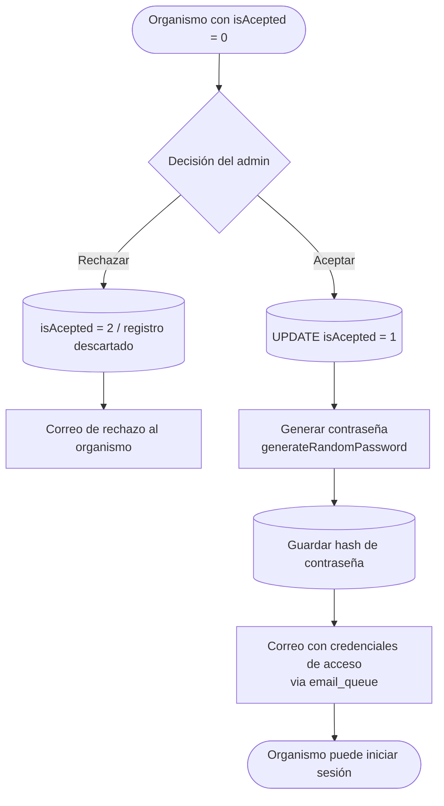
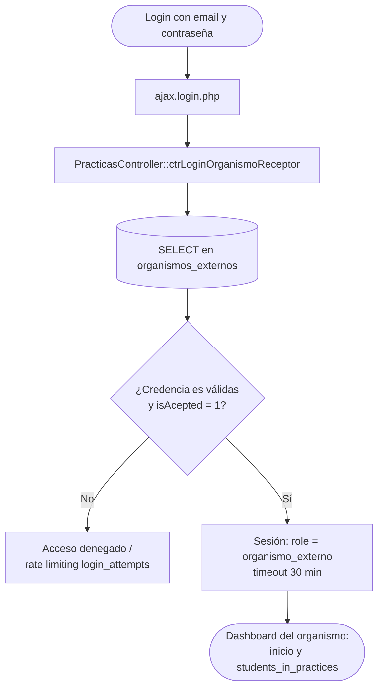
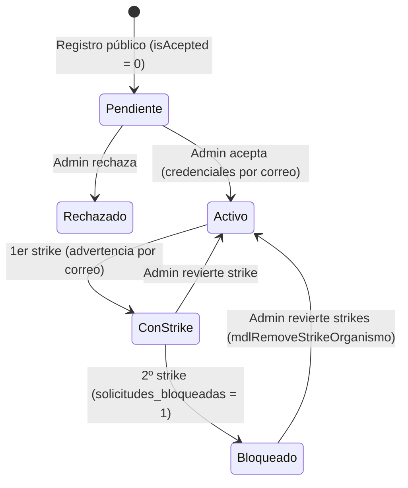

# Flujo de registro y aprobación de organismos externos (Prácticas)

Este documento describe el ciclo de vida de un organismo receptor: desde su registro público, la revisión del administrador de prácticas, la entrega de credenciales por correo y su primer inicio de sesión. Incluye el estado de bloqueo por strikes (Fase 3) que afecta su capacidad de publicar vacantes.

**Archivos involucrados:**

| Capa | Archivo | Responsabilidad |
|---|---|---|
| Vista pública | `RegisterEmpresas.php` | Formulario de registro sin autenticación |
| Endpoint registro | `controller/ajax/ajax.registroOrganismos.php` | Valida, guarda datos y documentos (rate limit 5/hora por sesión) |
| Admin | `controller/ajax/ajax.forms.php` (search=`organismos_externos`) y `controller/practices/companies.php` | Listado, aceptación/rechazo, estadísticas y export |
| Controlador | `controller/forms.controller.php` (`PracticasController`) | Aceptación, generación de contraseña, login |
| Modelo | `model/PracticasModel.php` | `saveOrganismoExterno`, `mdlGetExternals`, strikes/bloqueo |
| Correos | `controller/emails.php` | Credenciales de acceso, avisos de strikes y bloqueo |

**Tablas:** `organismos_externos`, `strikes_practicas`, `email_queue`, `notifications`, `logs`.

---

## 1. Registro público

El registro es un endpoint **sin autenticación** con rate limiting por sesión (5 intentos/hora). El organismo queda en `isAcepted = 0` hasta que un admin lo revise.

```mermaid
flowchart TD
    A([Empresa abre RegisterEmpresas.php<br/>sin login]) --> B[Llena datos: empresa, contacto,<br/>representante legal, giro]
    B --> C[Adjunta documentos opcionales docs&#91;&#93;]
    C --> D{Rate limit:<br/>¿menos de 5 registros/hora<br/>en esta sesión?}
    D -- No --> ERR1[Error: demasiados intentos]
    D -- Sí --> E{¿Validación de campos,<br/>MIME y extensión de archivos?}
    E -- No --> ERR2[Error de validación]
    E -- Sí --> F[(INSERT en organismos_externos<br/>isAcepted = 0)]
    F --> G[Guardar documentos en uploads/]
    G --> H([Organismo pendiente<br/>de revisión del admin])
```

> **Nota de seguridad (SEC-007):** el rate limiting es por sesión PHP, no por IP; un cliente que no envíe cookies lo evade. No hay CAPTCHA. Ver `docs/arquitectura_sistema.md`.

---

## 2. Revisión del administrador de prácticas

El `admin_practicas` ve los organismos pendientes en `internship_companies` (via `search=organismos_externos` → `mdlGetExternals`).

> **Nota (SEC-003):** `generateRandomPassword()` usa `rand()` (no criptográfico). Existe `Security::generatePassword()` con `random_int()` pero no se usa.

---

## 3. Inicio de sesión del organismo

---

## 4. Estados del organismo (incluye strikes Fase 3)

Una vez activo, el organismo acumula strikes cuando aprueba asistencias con exceso de horas (ver `docs/flujo_asistencias_alumnos.md`). Al segundo strike se bloquean sus **nuevas** solicitudes de practicantes, sin afectar las prácticas en curso.

- El bloqueo (`solicitudes_bloqueadas = 1` + `motivo_bloqueo`) se consulta en cada `solicitarPracticas` (ver `docs/flujo_vacantes_practicantes.md`).
- El admin puede quitar strikes; al bajar de 2 se levanta el bloqueo automáticamente.

---

## 5. Referencias cruzadas

- Publicación y gestión de vacantes: `docs/flujo_vacantes_practicantes.md`
- Selección de postulantes: `docs/flujo_postulacion_alumnos.md`
- Asistencias y strikes: `docs/flujo_asistencias_alumnos.md`
- Catálogo completo de correos: `docs/mails/practicas_profesionales.md`
