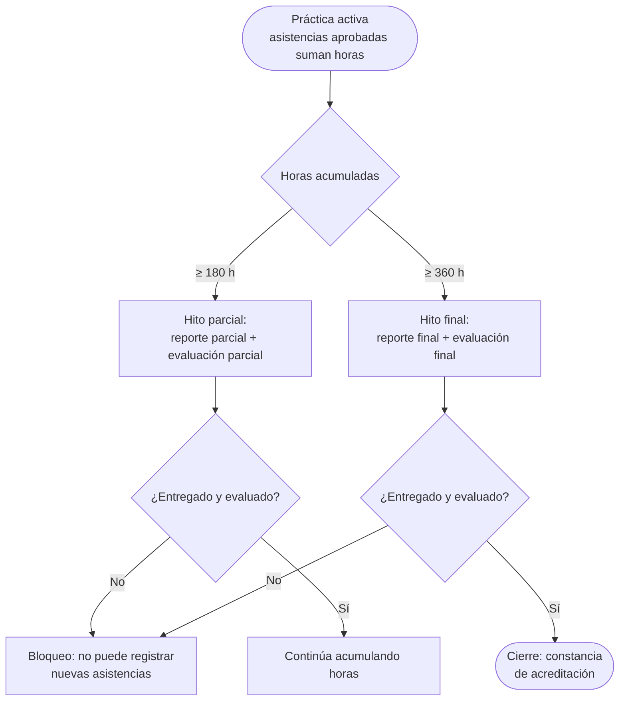
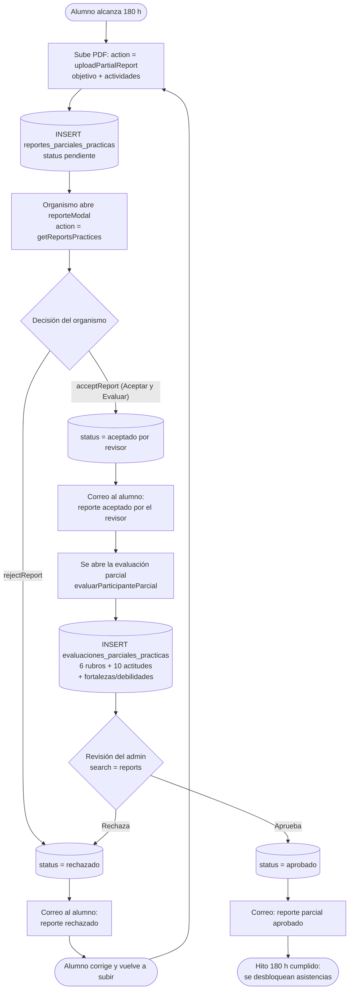
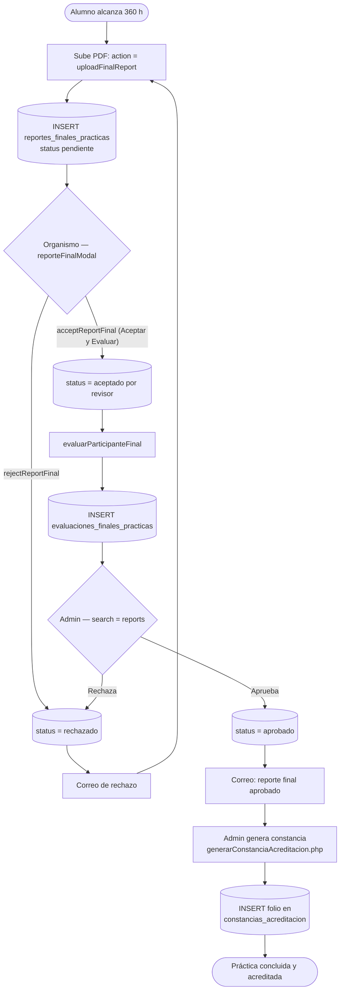
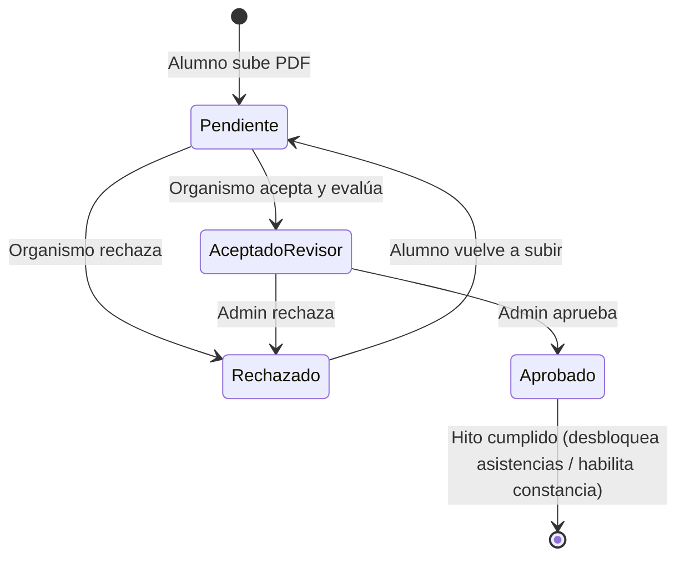

# Flujo de reportes y evaluaciones (Prácticas Profesionales)

Este documento describe los hitos de **180 horas** (reporte parcial + evaluación parcial) y **360 horas** (reporte final + evaluación final), la revisión en dos niveles (organismo → admin), las rúbricas de evaluación y el cierre con la constancia de acreditación. Estos hitos además **bloquean el registro de nuevas asistencias** si no se cumplen.

**Archivos involucrados:**

| Capa | Archivo | Responsabilidad |
|---|---|---|
| Alumno | `controller/practices/students_flow.php` (`uploadPartialReport`, `uploadFinalReport`) | Subida del reporte al alcanzar el hito de horas |
| Organismo | `controller/organismo/forms.php` (cases `getReportsPractices`, `acceptReport`, `rejectReport`, `acceptReportFinal`, `rejectReportFinal`, `evaluarParticipanteParcial`, `evaluarParticipanteFinal`) | Revisión del reporte y evaluación con rúbricas |
| Vista organismo | `view/pages/practicas/modalSolPracticantes.php` (modales `reporteModal`, `reporteFinalModal`) | Botones "Rechazar" / "Aceptar y Evaluar" |
| Admin | `controller/ajax/ajax.forms.php` (search=`reports`) | Aprobación final de reportes; vista `reports_practices` |
| Constancia | `controller/practices/generarConstanciaAcreditacion.php` | PDF con folio al concluir la práctica |
| Modelo | `model/PracticasModel.php` (`mdlCheckBloqueoEvaluaciones`, `mdlGetSemaforoEvaluaciones`, rúbricas en constantes) | Persistencia, bloqueos y semáforos |
| Correos | `controller/emails.php` | Reporte aceptado/rechazado, aprobado por admin, evaluaciones |

**Tablas:** `reportes_parciales_practicas`, `reportes_finales_practicas`, `evaluaciones_parciales_practicas`, `evaluaciones_finales_practicas`, `constancias_acreditacion`, `asistencias_practicas` (horas acumuladas), `email_queue`, `notifications`.

---

## 1. Vista general — hitos por horas acumuladas

Las horas validadas de asistencias aprobadas (ver `docs/flujo_asistencias_alumnos.md`) alimentan dos hitos. Si el alumno alcanza el hito y **no entrega** el reporte o falta la evaluación, `mdlCheckBloqueoEvaluaciones` bloquea el registro de nuevas asistencias.

---

## 2. Reporte parcial (hito 180 h)

Doble revisión: primero el **organismo** (que al aceptar pasa directo a evaluar), después el **admin de prácticas**.

---

## 3. Reporte final (hito 360 h)

Mismo esquema que el parcial, con el modal `reporteFinalModal` (incluye capacitación recibida, experiencia personal/profesional y resultados obtenidos) y la evaluación final.

---

## 4. Rúbricas de evaluación (parcial y final)

Ambas evaluaciones usan la misma estructura, definida como constantes en `PracticasModel`:

**Rubros (6):** asistencia y puntualidad · aplicación de conocimientos · contribución a la solución de problemas · iniciativa · responsabilidad · logro de objetivos.

**Actitudes (10):** interés en subsanar necesidades de aprendizaje · cooperación en equipo · tolerancia · expresión verbal y escrita · soluciones dentro de normas · organización y priorización · búsqueda de información adicional · adaptación · automotivación · receptividad ante la autoridad.

Más campos abiertos de **fortalezas** y **debilidades**.

**Semáforo de evaluaciones:** `mdlGetSemaforoEvaluaciones` calcula por alumno un indicador `semaforo_empresa` / `semaforo_alumno` que el organismo ve en su lista de practicantes (`getAllPractices`) para saber quién tiene evaluaciones pendientes.

---

## 5. Estados de un reporte

> **Nota de seguridad:** las evaluaciones del organismo **no verifican** que el alumno pertenezca al organismo en sesión (ver SEC-006 en `docs/arquitectura_sistema.md`).

---

## 6. Referencias cruzadas

- Acumulación de horas y bloqueos: `docs/flujo_asistencias_alumnos.md`
- Cómo llegó el alumno a la práctica: `docs/flujo_postulacion_alumnos.md`
- Correos del proceso (Nos. 8–11 del catálogo): `docs/mails/practicas_profesionales.md`
