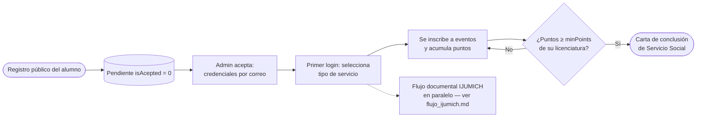
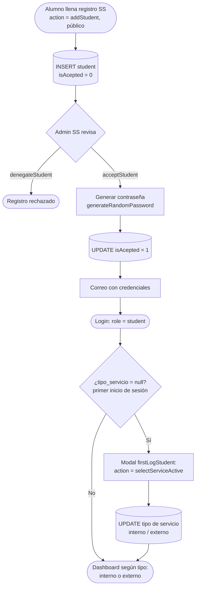
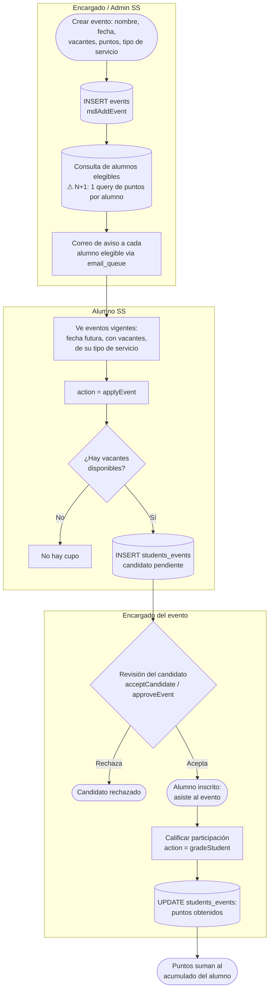
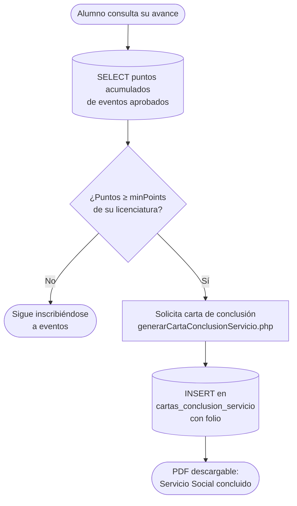
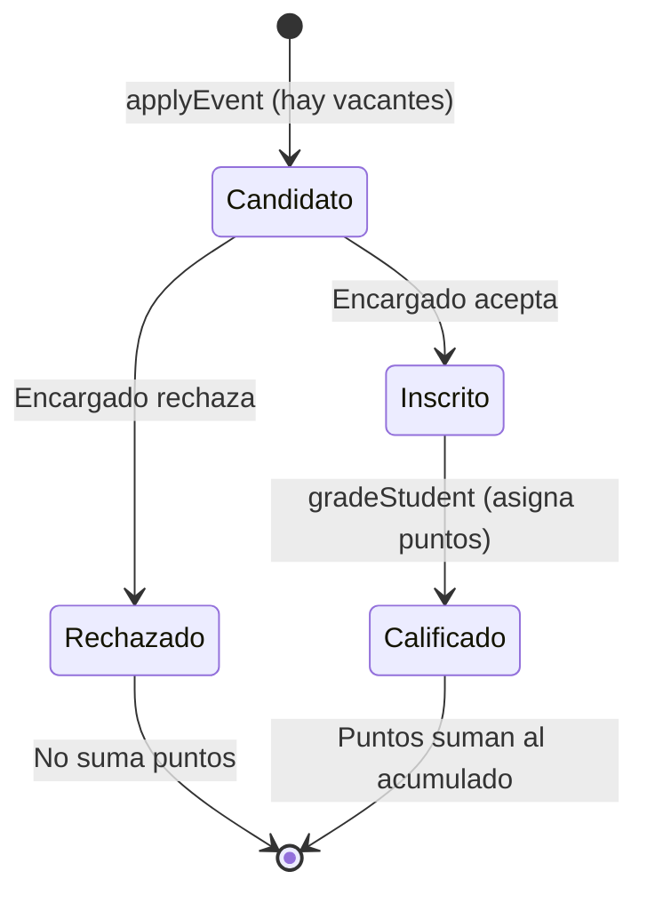

# Flujo de Servicio Social — Alumnos, eventos y puntos

Este documento describe el ciclo del alumno de Servicio Social (rol `student`): registro y aprobación, selección del tipo de servicio, inscripción a eventos con puntos, calificación por el encargado (teacher) y la meta de puntos mínimos por licenciatura que habilita la carta de conclusión. El flujo documental IJUMICH se detalla aparte en `docs/flujo_ijumich.md`.

**Archivos involucrados:**

| Capa | Archivo | Responsabilidad |
|---|---|---|
| Registro | `controller/ajax/ajax.forms.php` (search=`student`, action=`addStudent`) | Alta pública del alumno SS (`isAcepted = 0`) |
| Admin SS | `controller/ajax/ajax.forms.php` (search=`student`: `acceptStudent`, `denegateStudent`, `dropStudent`, `editStudent`) | Gestión de alumnos |
| Primer login | `view/pages/modals/firstLogStudent.php` + action=`selectServiceActive` | Selección del tipo de servicio |
| Eventos | `controller/ajax/ajax.forms.php` (search=`event`: `applyEvent`, `approveEvent`, `acceptCandidate`, `gradeStudent`) | Ciclo del evento |
| Controlador | `controller/forms.controller.php` (`FormsController`) | Login, eventos, puntos |
| Modelo | `model/generalModels.php` (`FormsModel`: `mdlAddEvent`, `mdlApplyEvent`, `mdlStudentPoints`, `mdlStudentEventsPoints`) | Persistencia SS |
| Carta | `controller/ajax/generarCartaConclusionServicio.php` | PDF al cumplir puntos mínimos |
| Correos | `controller/emails.php` | Credenciales, aviso de nuevos eventos, resultados |

**Tablas:** `student`, `events`, `event_types`, `students_events`, `degrees` (con `minPoints`), `courses`, `areas`, `areas_users`, `tipo_servicio`, `cartas_conclusion_servicio`, `email_queue`.

---

## 1. Vista general

---

## 2. Registro y aprobación del alumno

> El tipo elegido define el dashboard (`dashboardEstudianteInterno.php` / `dashboardEstudianteExterno.php`) y qué eventos ve el alumno (filtrados por `tipo_servicio`).

---

## 3. Ciclo de un evento con puntos

El encargado (teacher) o el admin SS crea eventos con vacantes y puntos. El alumno se inscribe si hay cupo; el encargado aprueba candidatos y al final califica la participación asignando los puntos.

> **Cuello de botella (OPT-001):** `mdlAddEvent` carga todos los alumnos y consulta sus puntos uno por uno (N+1) para decidir a quién avisar por correo.

---

## 4. Meta de puntos y carta de conclusión

Cada licenciatura (`degrees`) define un mínimo de puntos (`minPoints`). El dashboard del alumno muestra su avance (`mdlStudentEventsPoints`).

---

## 5. Estados del alumno en un evento

---

## 6. Referencias cruzadas

- Flujo documental IJUMICH (9 pasos interno / externo): `docs/flujo_ijumich.md`
- Catálogo de correos de Servicio Social: `docs/mails/servicio_social.md`
- Hallazgos de seguridad relacionados (SEC-004 roles en AJAX): `docs/arquitectura_sistema.md`
