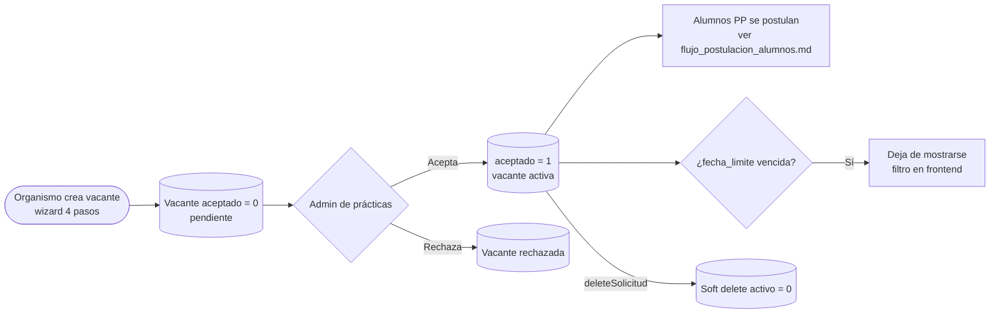
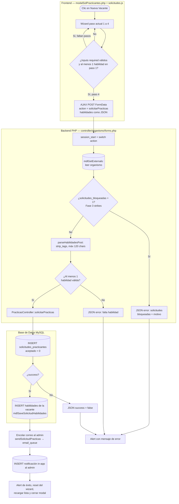
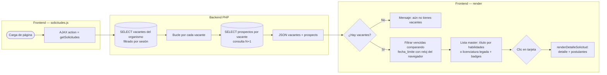
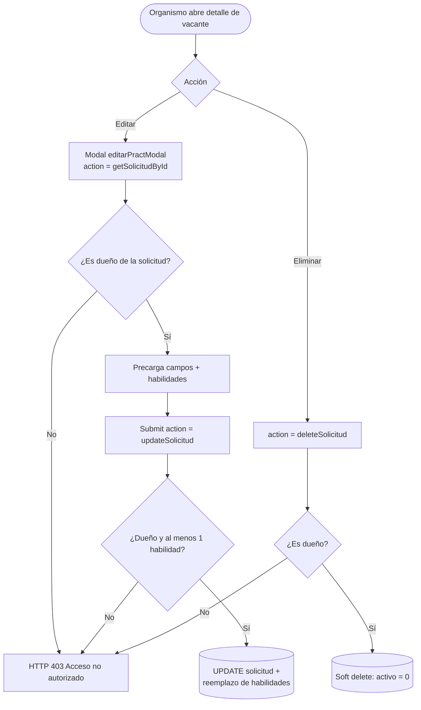
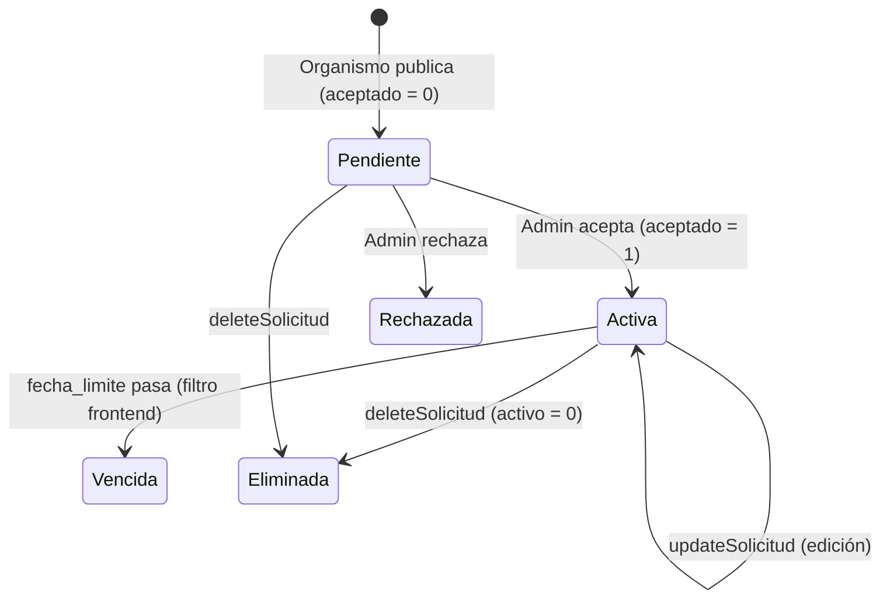

# Flujo de vacantes de practicantes (Organismo externo)

Este documento describe el ciclo de vida de una vacante (solicitud de practicantes): creación desde el wizard del organismo, verificación de bloqueo por strikes, guardado con habilidades del perfil, gestión master-detail, edición, eliminación y expiración.

**Archivos involucrados:**

| Capa | Archivo | Responsabilidad |
|---|---|---|
| Vista | `view/pages/practicas/modalSolPracticantes.php` | Modales: gestor master-detail, wizard "Nueva Vacante" (4 pasos), edición, candidatos, reportes |
| JS | `view/assets/js/organismo/solicitudes.js` | Wizard, selector de habilidades, horario (+4h automática), AJAX y render de lista/detalle |
| Router organismo | `controller/organismo/forms.php` (cases `solicitarPracticas`, `getSolicitudes`, `getSolicitudById`, `updateSolicitud`, `deleteSolicitud`, `getHabilidadesCatalogo`) | Valida sesión, bloqueo por strikes, sanitiza habilidades, verifica propiedad |
| Controlador | `controller/forms.controller.php` (`PracticasController::solicitarPracticas`, `getSolicitudesPracticas`, `updateSolicitudPractica`, `deleteSolicitudPractica`) | Orquesta modelo + correos + notificaciones |
| Modelo | `model/PracticasModel.php` (`mdlSolicitarPracticas`, `mdlSaveSolicitudHabilidades`, `mdlGetSolicitudesPracticas`, `mdlGetProspectsBySolicitud`) | Persistencia |
| Admin | `controller/ajax/ajax.forms.php` (search=`practices`) | Aceptar/rechazar la vacante (`aceptado = 1`) |
| Correos | `controller/emails.php` (`sendSolicitudPracticas`) | Aviso al admin de nueva solicitud (via `email_queue`) |

**Tablas:** `solicitudes_practicantes`, `solicitudes_habilidades` (relación vacante↔habilidad), catálogo de habilidades, `organismos_externos`, `students_in_practices` (prospectos), `notifications`, `email_queue`.

> **Nota de alcance (2026):** el perfil de la vacante se define por **habilidades** (nuevo modelo). El campo `licenciatura` queda como legado para vacantes antiguas; el frontend muestra habilidades cuando existen y licenciatura como respaldo.

---

## 1. Vista general

---

## 2. Creación — Wizard "Nueva Vacante" (4 pasos)

El wizard valida con HTML5 por paso y exige **al menos una habilidad** (paso 1). El horario propone jornadas Lun–Vie de 4 horas: la hora de salida se calcula automáticamente (+4h). Al enviar, el AJAX agrega `action=solicitarPracticas`.

Pasos del wizard:

1. **Perfil del Estudiante** — habilidades (chips con catálogo + personalizadas), número de vacantes, aptitudes deseadas.
2. **Plan Formativo** — actividades, funciones, objetivos, competencias, resultados esperados.
3. **Condiciones y Horario** — modalidad, fecha límite, apoyo económico (monto condicional), horario con salida automática.
4. **Sede y Responsable** — dirección, nombre y teléfono del responsable.

> **Notas:**
> - La validación de campos (`numPract`, `fechaLimite`, horario) es **solo de cliente**; el backend únicamente re-valida habilidades y bloqueo. Un POST directo puede insertar datos inválidos.
> - El correo **no bloquea** la respuesta: `MailService::sendMail` encola en `email_queue` y retorna de inmediato (ver `docs/flujo_correos.md`).

---

## 3. Gestor de vacantes (master-detail)

Al abrir el gestor, `solicitudes()` trae todas las vacantes del organismo con sus prospectos y pinta la lista (panel izquierdo) y el detalle al hacer clic (panel derecho).

> **Cuellos de botella conocidos:** consulta N+1 de prospectos (`getSolicitudesPracticas`) y filtro de vencidas con la fecha del **cliente** (un reloj desfasado muestra/oculta vacantes incorrectamente).

---

## 4. Edición y eliminación

Ambas verifican **propiedad**: la solicitud debe pertenecer al `organismo_externo_id` de la sesión (HTTP 403 si no).

---

## 5. Estados de una vacante

---

## 6. Referencias cruzadas

- Alta del organismo y bloqueo por strikes: `docs/flujo_registro_organismos.md`
- Postulación y selección de alumnos sobre la vacante: `docs/flujo_postulacion_alumnos.md`
- Asistencias de los practicantes aceptados: `docs/flujo_asistencias_alumnos.md`
- Correos involucrados: `docs/mails/practicas_profesionales.md`
